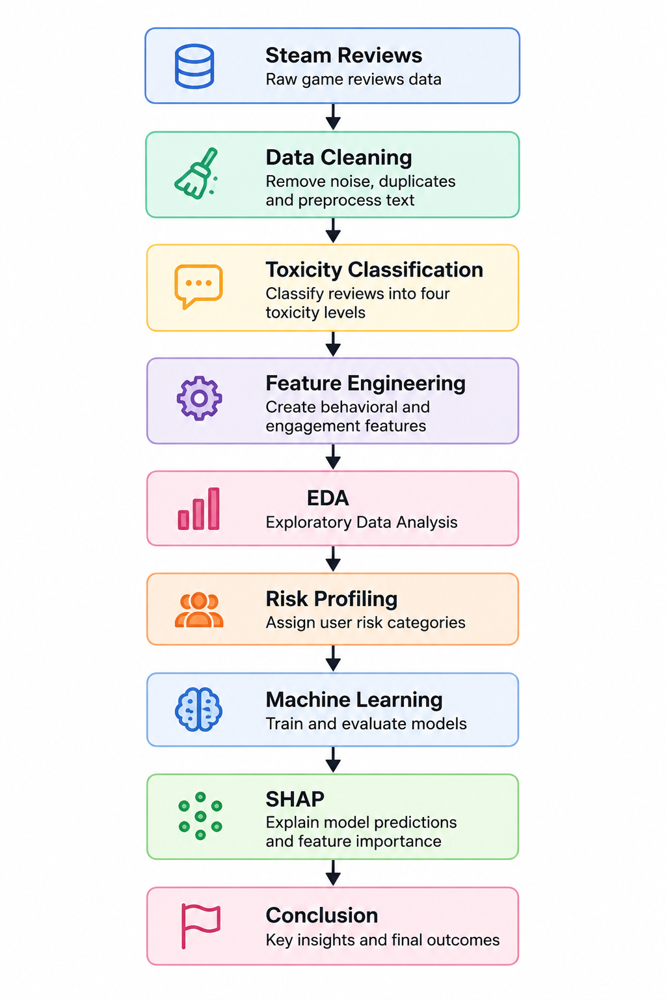

# Toxic Behavior and Risk Pattern Analysis in Online Gaming Using Machine Learning


An end-to-end machine learning project for analysing toxic user behaviour and predicting player risk using Steam game reviews, behavioural analytics, and explainable AI.

---

<table>
<tr>

<td width="58%" valign="top">

## Project Overview

This project investigates toxic behaviour and user risk patterns in online gaming communities using Steam game review data.

The study combines natural language processing, behavioural analytics, feature engineering, machine learning, and explainable AI to classify toxicity levels and predict user risk profiles.

### Key Workflow

- Data Cleaning & Preprocessing
- Toxicity Classification
- Behavioural Feature Engineering
- Exploratory Data Analysis
- User Risk Profiling
- Machine Learning
- Explainable AI (SHAP)

</td>

<td width="42%" valign="top">

## Project Workflow



</td>

</tr>
</table>

---

## Project Objectives

- Analyse toxic behaviour in Steam game reviews.
- Classify reviews into four toxicity levels: **Normal**, **Mild**, **Moderate**, and **Severe**.
- Engineer behavioural features from player activity and engagement.
- Develop machine learning models to predict toxicity levels.
- Predict overall user risk categories.
- Explain model predictions using SHAP for improved transparency.

---

## Technologies Used

| Category | Technologies |
|-----------|--------------|
| Programming Language | Python |
| Data Analysis | Pandas, NumPy |
| Data Visualization | Matplotlib, Seaborn |
| Machine Learning | Scikit-learn, XGBoost |
| Explainable AI | SHAP |
| Development Environment | Kaggle Notebook |
| Version Control | Git & GitHub |

---

## Machine Learning Models

Three supervised machine learning algorithms were developed and compared.

| Model | Toxicity Classification | Risk Classification |
|--------|-------------------------|---------------------|
| Logistic Regression | ✓ | ✓ |
| Random Forest | ✓ | ✓ |
| XGBoost | ✓ | ✓ |

Performance was evaluated using:

- Accuracy
- Precision
- Recall
- F1 Score

---

## Key Results

| Prediction Task | Best Model | Accuracy |
|----------------|-----------|----------|
| Toxicity Classification | XGBoost | **99.82%** |
| User Risk Classification | XGBoost | **99.70%** |

### Highlights

- Classified over **150,000** Steam reviews into four toxicity levels.
- Engineered behavioural features from player activity and engagement.
- Developed two high-performing machine learning classification models.
- Applied SHAP to explain feature importance and model predictions.

---

## Repository Structure

```text
steam-game-review-analytics/
│
├── README.md
├── steam_game_review_analytics.ipynb
├── requirements.txt
├── LICENSE
└── images/
```

---

##  How to Run the Project

### 1. Clone the repository

```bash
git clone https://github.com/anum-ahmed/steam-game-review-analytics.git
```

### 2. Install the required libraries

```bash
pip install -r requirements.txt
```

### 3. Open the notebook

```text
steam_game_review_analytics.ipynb
```

### 4. Run all notebook cells from top to bottom.

---

##  Dataset Information

- **Dataset:** Steam Game Reviews Dataset
- **Source:** Kaggle
- **Original Records:** 1,048,148 reviews
- **Working Dataset:** 150,000 English-language reviews
- **Data Type:** User-generated game reviews and behavioural metadata

The dataset contains review text, gameplay statistics, recommendation status, user engagement metrics, and behavioural information used for toxicity classification and risk prediction.

---

##  Author

**Anum Ahmed**

- MSc Data Analytics (Distinction)
- Business Analyst
- Machine Learning & Applied AI Researcher

**GitHub**

https://github.com/anum-ahmed

**LinkedIn**

YOUR_LINKEDIN_URL

---

##  License

This project is released under the MIT License.

See the **LICENSE** file for more information.

---

##  Future Work

Potential future improvements include:

- Deep learning-based toxicity detection
- Transformer-based language models (BERT and RoBERTa)
- Real-time toxicity monitoring
- Interactive moderation dashboard
- Web application deployment

---

## 📚 Citation

If you use this project for research, learning, or educational purposes, please cite or acknowledge this repository appropriately.
